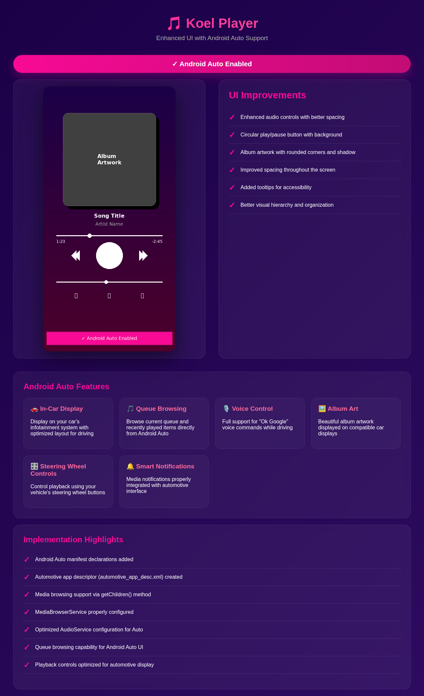
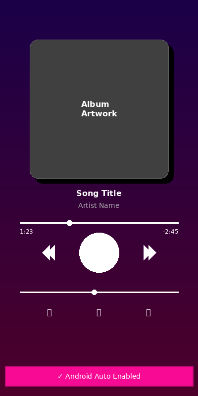

# Koel Player Documentation

This directory contains documentation for the Koel Player mobile app.

## Contents

- **[ANDROID_AUTO_IMPLEMENTATION.md](ANDROID_AUTO_IMPLEMENTATION.md)** - Comprehensive documentation about Android Auto support implementation
- **[ui_improvements.txt](ui_improvements.txt)** - Text-based visualization of UI improvements
- **[ui_mockup.png](ui_mockup.png)** - Visual mockup of the enhanced UI

## Recent Updates

### Android Auto Support (2025)

The app now supports Android Auto, allowing users to:
- Control playback from their car's infotainment system
- Browse current queue and recently played items
- Use voice commands
- View album artwork on compatible displays
- Control playback via steering wheel buttons

### UI Enhancements

Enhanced the Now Playing screen with:
- Rounded corners and shadows on album artwork
- Larger, more prominent play/pause button with circular background
- Better spacing and visual hierarchy
- Improved accessibility with tooltips
- More polished overall appearance

## Screenshots

### Complete Android Auto Implementation

The screenshot above shows:
- Enhanced Now Playing screen UI with improved visual design
- Complete Android Auto integration details
- All UI improvements implemented
- List of Android Auto features available
- Implementation highlights

### UI Mockup

The mockup shows the improved Now Playing screen with:
- Album artwork with shadow and rounded corners
- Large circular play/pause button
- Better spaced previous/next controls
- Volume slider
- Bottom action buttons (repeat, lyrics, queue)
- Android Auto enabled indicator

## Building the App

See the main [README.md](../README.md) in the root directory for build instructions.

## Contributing

When adding new features or making significant changes, please:
1. Update relevant documentation
2. Add screenshots or mockups if UI changes are involved
3. Document any new dependencies or requirements
